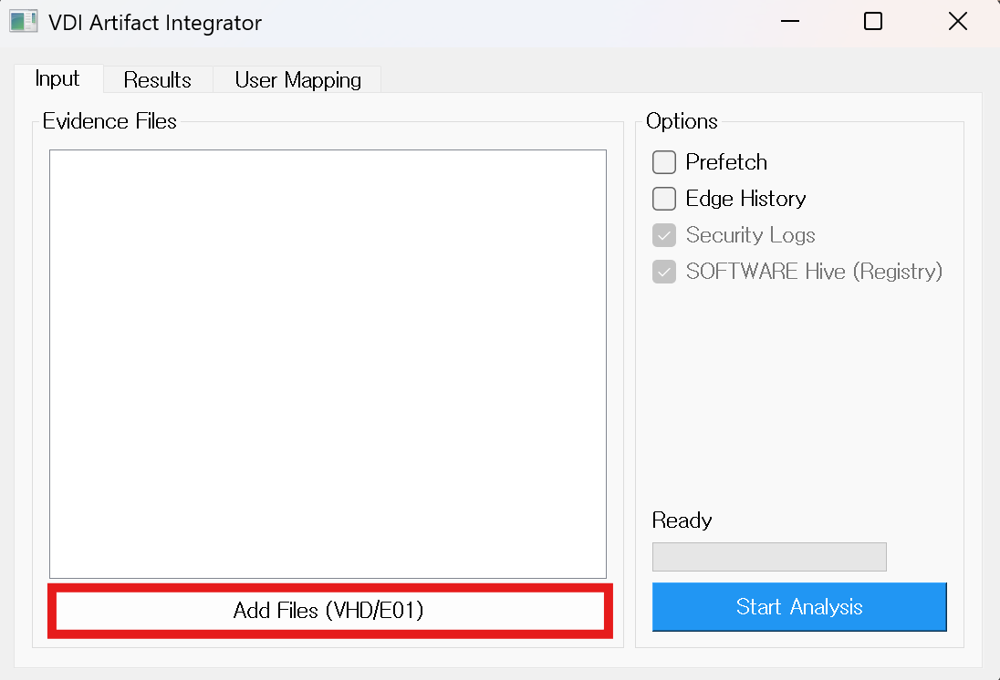
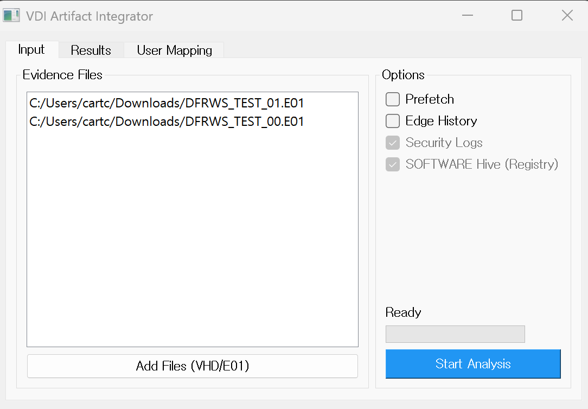
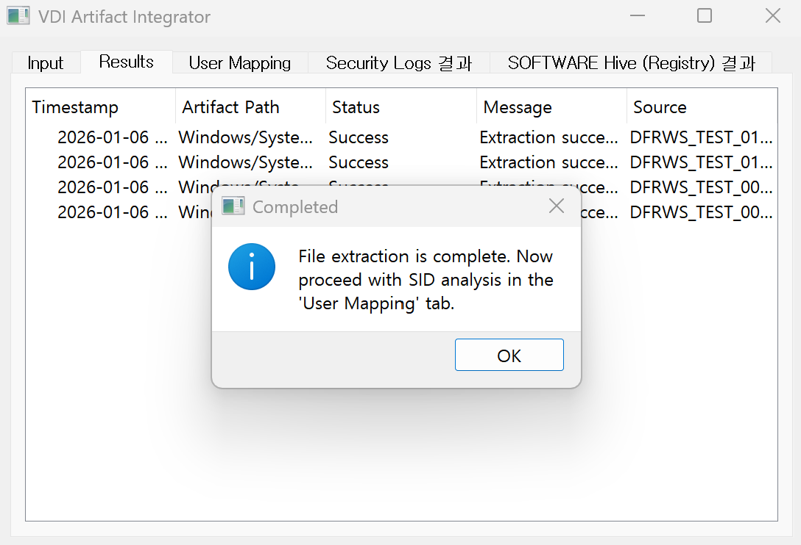
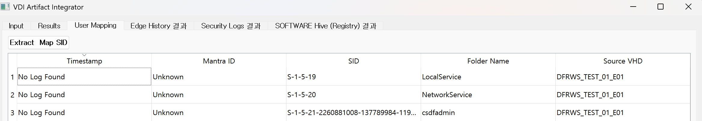
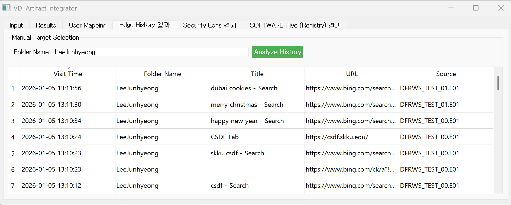

# VDI Artifact Integrator

## 1. Introduction

### 1.1. Tool Overview

The VDI Artifact Integrator is a specialized forensic collection and analysis tool designed for Pooled VDI environments . In such environments, user artifacts are frequently fragmented across various Virtual Machines (VMs). This tool addresses the challenge of identifying user-accessed VMs and aggregating these fragmented data points into a single, cohesive analysis view.

### 1.2. Key Features

- Multi-Image Analysis: Supports batch processing of forensic evidence files (optimized for `.E01` format).
- Artifact Extraction & Integration:
- Windows Prefetch: Consolidates execution history across different sessions and VMs.
- Edge History: Aggregates fragmented web browsing activities.
- VM-Specific User Identification: Maps technical identifiers ( SID , Mantra ID ) to actual Usernames for precise attribution.

## 2. System Design & Implementation Environment

### 2.1. System Design

- GUI-based Integrated Interface: Provides a user-friendly environment for complex forensic workflows.
- Asynchronous Processing: Employs `QThread` to ensure the UI remains responsive during intensive data extraction and analysis.
- Recursive Artifact Extraction: Features a robust recursive search logic to handle diverse partition layouts and nested file system structures.
- Cross-Artifact Identity Mapping: Correlates `SOFTWARE` registry hives with `Security.evtx` logs to establish a reliable link between SIDs, Mantra IDs, and users.

### 2.2. Implementation Environment

| Category      | Item            | Version / Specification | Usage                                     |
| :------------ | :-------------- | :---------------------- | :---------------------------------------- |
| OS            | Windows         | 10 / 11 (64-bit)        | Analysis Host Environment                 |
| Language      | Python          | 3.11.x                  | Core Application Logic                    |
| UI Framework  | PyQt5           | 5.15.10                 | GUI & Multi-threading Management          |
| Image/FS      | pytsk3          | 20250801                | TSK (The Sleuth Kit) File System Analysis |
| E01 Support   | libewf-python   | 20240506                | EnCase (E01) Evidence Image Handling      |
| Registry      | python-registry | 1.3.1                   | Windows Registry Hive Parsing             |
| Event Log     | python-evtx     | 0.6.1                   | Event Log (.evtx) Data Extraction         |
| External Tool | PECmd           | 1.5.1                   | High-precision Windows Prefetch Parsing   |

---

## 3. Architecture & Modules

### 3.1. File Structure

```text
VDI-Artifact-Integrator/
├── config.yaml             # Configuration (Paths, Formats, Active Artifacts)
├── src/                    # Main Source Code
│   ├── core/               # Core Engines
│   │   ├── vhd_manager.py  # Image Mounting/Parsing & ID Generation
│   │   └── sid_mapper.py   # SID-Username Mapping (SOFTWARE/Security.evtx)
│   ├── parsers/            # Artifact Parser Modules (Plugin-based)
│   │   ├── __init__.py     # Parser Interface Definitions
│   │   ├── prefetch_p.py   # Prefetch Parser
│   │   └── edge_p.py       # Edge Browser History Parser
│   └── gui/                # GUI Implementation
│       └── main_window.py
├── workspace/              # Temporary storage for extracted artifacts
│   └── [VHD_HASH]/         # Organized by unique image hash
├── tools/                  # External Forensic Binaries
│   └── PECmd.exe           # Prefetch Analysis Engine (Eric Zimmerman)
└── requirements.txt        # Python Dependency List
```

## 3.2. Key Module Descriptions

main_window.py: Manages the main user interface. It ensures that heavy operations (like image loading) are offloaded to background threads to maintain UI stability.

vhd_manager.py: The heart of the file system analysis. It leverages pytsk3 and libewf to analyze partition structures. It uses a recursive search algorithm with wildcard support to locate and extract artifacts regardless of their directory depth.

sid_mapper.py: Responsible for user attribution. It extracts Mantra IDs from Security.evtx and maps them to Usernames using the SOFTWARE registry hive.

edge_history_parser.py: Consolidates fragmented browser history databases into a single, unified timeline.

prefetch_parser.py: A wrapper that invokes PECmd.exe as a sub-process, ensuring industry-standard accuracy in prefetch analysis.

# 4. Usage

## 4.1. Prerequisites & Installation
Ensure Python 3.11+ is installed, then run:

```Bash
pip install -r requirements.txt
```

## 4.2. Analysis Workflow

1. Load Evidence: Import multiple .E01 files into the analysis list.
   

2. Select Artifacts: Choose the artifacts to extract. (Note: Security logs and SOFTWARE Hives are required for SID mapping.)
   
3. Execute Analysis: Click 'Start Analysis' to begin automated extraction and parsing.
   
4. Identity Attribution: Use the 'Extract Map SID' feature to correlate technical data with actual usernames.
   
5. Data Review: Browse the integrated results in the result tabs.
   


